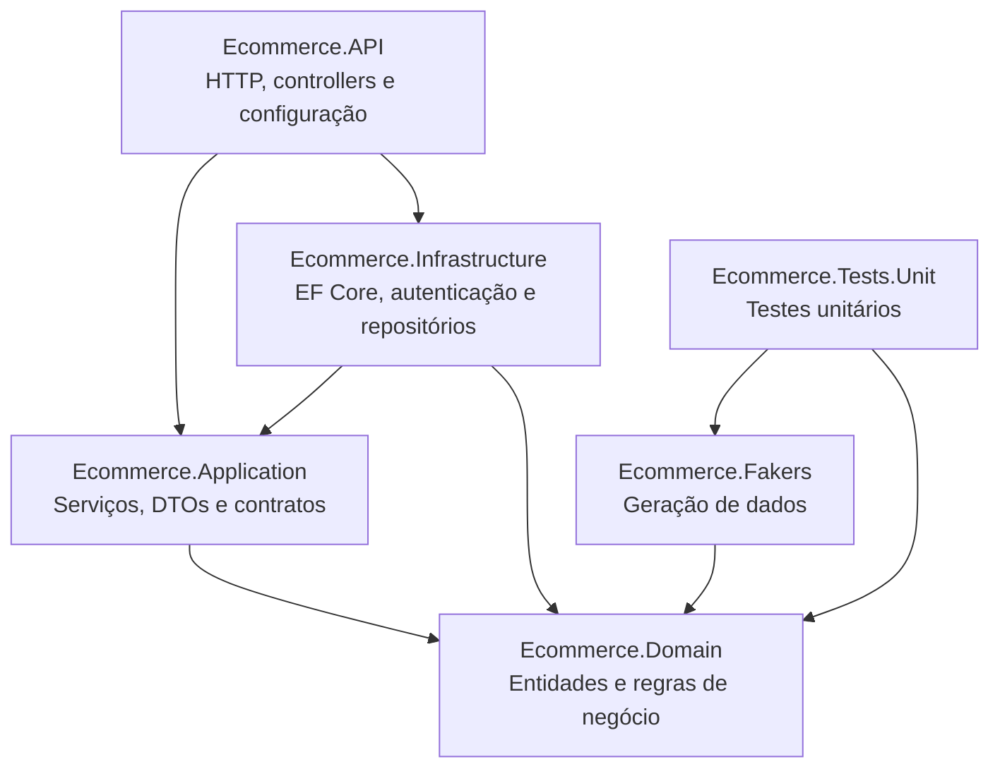
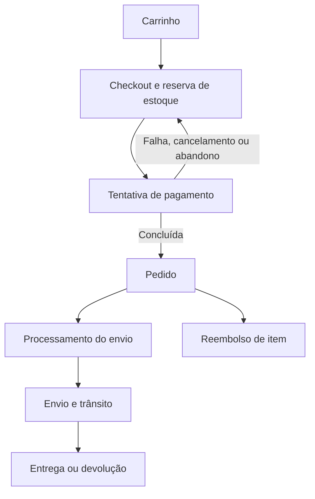

# E-commerce API


API RESTful para uma plataforma de e-commerce, desenvolvida com ASP.NET Core, Entity Framework Core e PostgreSQL. A solução cobre autenticação, catálogo, carrinho, checkout, pagamentos, pedidos, entregas, reembolsos e operações administrativas.

O projeto utiliza uma arquitetura em camadas inspirada em Clean Architecture, com regras de negócio concentradas no domínio, casos de uso na camada de aplicação e detalhes técnicos isolados na infraestrutura.

## Sumário

- [Funcionalidades](#funcionalidades)
- [Tecnologias](#tecnologias)
- [Arquitetura](#arquitetura)
- [Modelo de domínio](#modelo-de-domínio)
- [Como executar](#como-executar)
- [Configuração](#configuração)
- [Autenticação e autorização](#autenticação-e-autorização)
- [Paginação](#paginação)
- [Endpoints](#endpoints)
- [Respostas de erro](#respostas-de-erro)
- [Testes](#testes)
- [Migrations e dados de desenvolvimento](#migrations-e-dados-de-desenvolvimento)

## Funcionalidades

- Cadastro, login, logout e renovação de sessão com access token e refresh token.
- Autenticação JWT e autorização por função de usuário.
- Gerenciamento do perfil, senha, imagem de avatar e endereços de entrega.
- Catálogo de produtos e categorias com paginação.
- Carrinho individual por usuário, com inclusão, alteração e remoção de itens.
- Criação de checkout a partir do carrinho.
- Reserva e confirmação de estoque durante o fluxo de compra.
- Seleção do endereço de entrega e da forma de pagamento.
- Controle das tentativas e dos estados de pagamento.
- Criação de pedidos após a conclusão do pagamento.
- Rastreamento dos estados de envio e entrega.
- Reembolso de itens do pedido.
- Área administrativa para usuários, produtos, categorias, carrinhos, checkouts e pedidos.
- Erros padronizados no formato `ProblemDetails`.
- Documentação interativa por Swagger/OpenAPI.
- Seeders para popular o ambiente de desenvolvimento.

## Tecnologias

| Tecnologia | Uso no projeto |
| --- | --- |
| .NET 8 | Plataforma e runtime |
| ASP.NET Core Web API | Controllers, autenticação, autorização e pipeline HTTP |
| Entity Framework Core 8 | Persistência e migrations |
| PostgreSQL + Npgsql | Banco de dados relacional |
| JWT Bearer | Access tokens e autorização por roles |
| BCrypt.Net | Hash e verificação de senhas |
| Swagger / OpenAPI | Exploração e teste dos endpoints |
| libphonenumber-csharp | Validação e normalização de telefones |
| Bogus | Geração de dados para seeders e testes |
| xUnit | Testes unitários |
| Coverlet | Coleta de cobertura de testes |

## Arquitetura



### Responsabilidade dos projetos

| Projeto | Responsabilidade |
| --- | --- |
| `Ecommerce.Domain` | Entidades, value objects, enums, exceções e invariantes do negócio |
| `Ecommerce.Application` | Casos de uso, DTOs, mapeadores, paginação e interfaces de serviços/repositórios |
| `Ecommerce.Infrastructure` | `DbContext`, configurações do EF Core, migrations, repositórios, JWT, BCrypt e seeders |
| `Ecommerce.API` | Controllers, injeção de dependências, autenticação, CORS, Swagger e tratamento global de erros |
| `Ecommerce.Fakers` | Fakers reutilizáveis para geração de entidades e dados de desenvolvimento |
| `Ecommerce.Tests.Unit` | Testes unitários das entidades e dos value objects do domínio |

### Estrutura da solução

```text
.
├── Ecommerce.API
│   ├── API
│   ├── Controllers
│   │   └── Admins
│   └── ExceptionHandlers
├── Ecommerce.Application
│   ├── DTOs
│   ├── Interfaces
│   ├── Mappers
│   ├── Pagination
│   └── Services
├── Ecommerce.Domain
│   ├── Entities
│   ├── Enums
│   ├── Exceptions
│   └── ValueObjects
├── Ecommerce.Infrastructure
│   ├── Authentication
│   ├── BackgroundServices
│   ├── Configuration
│   └── Data
│       ├── Migrations
│       ├── Repositories
│       └── Seeders
├── Ecommerce.Fakers
├── Ecommerce.Tests.Unit
├── Ecommerce.sln
└── LICENSE
```

## Modelo de domínio

| Área | Principais tipos |
| --- | --- |
| Identidade | `User`, `RefreshToken` |
| Catálogo | `Product`, `Category` |
| Carrinho | `Cart`, `CartItem` |
| Compra | `Checkout`, `CheckoutItem`, `PaymentAttempt` |
| Pós-compra | `Order`, `OrderItem`, `Shipping`, `Refund` |
| Value objects | `Money`, `Quantity`, `Email`, `PhoneNumber`, `PersonName`, `ShippingAddress` e objetos de nome, descrição e imagem |

### Fluxo principal de compra



## Como executar

### Pré-requisitos

- [.NET SDK 8](https://dotnet.microsoft.com/download/dotnet/8.0)
- Uma instância do PostgreSQL acessível pela aplicação
- `dotnet-ef` 8.x para aplicar ou criar migrations
- Opcionalmente, um cliente como Postman, Insomnia ou `curl`

### 1. Restaurar as dependências

Na raiz da solução:

```bash
dotnet restore Ecommerce.sln
```

Se ainda não tiver a ferramenta do Entity Framework instalada:

```bash
dotnet tool install --global dotnet-ef --version 8.*
```

### 2. Configurar o banco e o JWT

Use User Secrets no ambiente de desenvolvimento:

```bash
dotnet user-secrets set "ConnectionStrings:Default" "Host=localhost;Port=5432;Database=ecommerce;Username=postgres;Password=SUA_SENHA" --project Ecommerce.API/Ecommerce.API.csproj

dotnet user-secrets set "Jwt:Key" "SUA_CHAVE_SECRETA_FORTE_COM_PELO_MENOS_32_BYTES" --project Ecommerce.API/Ecommerce.API.csproj
dotnet user-secrets set "Jwt:Issuer" "Ecommerce.API" --project Ecommerce.API/Ecommerce.API.csproj
dotnet user-secrets set "Jwt:Audience" "Ecommerce.Client" --project Ecommerce.API/Ecommerce.API.csproj
dotnet user-secrets set "Jwt:AccessTokenExpirationMinutes" "15" --project Ecommerce.API/Ecommerce.API.csproj
dotnet user-secrets set "Jwt:RefreshTokenExpirationDays" "7" --project Ecommerce.API/Ecommerce.API.csproj
```

### 3. Aplicar as migrations

```bash
dotnet ef database update \
  --project Ecommerce.Infrastructure/Ecommerce.Infrastructure.csproj \
  --startup-project Ecommerce.API/Ecommerce.API.csproj
```

### 4. Executar a API

```bash
dotnet run --project Ecommerce.API/Ecommerce.API.csproj
```

No perfil de desenvolvimento, a aplicação fica disponível em:

- Swagger: `https://localhost:7130/swagger`
- HTTPS: `https://localhost:7130`
- HTTP: `http://localhost:5025`

Se necessário, prepare o certificado HTTPS local com:

```bash
dotnet dev-certs https --trust
```

## Configuração

A aplicação lê as seguintes chaves:

| Chave | Obrigatória | Descrição |
| --- | --- | --- |
| `ConnectionStrings:Default` | Sim | String de conexão do PostgreSQL |
| `Jwt:Key` | Sim | Chave usada para assinar os access tokens |
| `Jwt:Issuer` | Sim | Emissor esperado no JWT |
| `Jwt:Audience` | Sim | Audiência esperada no JWT |
| `Jwt:AccessTokenExpirationMinutes` | Sim | Duração do access token em minutos |
| `Jwt:RefreshTokenExpirationDays` | Sim | Duração do refresh token em dias |

Em produção, prefira um gerenciador de segredos ou variáveis de ambiente. O separador `:` das chaves deve ser substituído por `__`:

```text
ConnectionStrings__Default
Jwt__Key
Jwt__Issuer
Jwt__Audience
Jwt__AccessTokenExpirationMinutes
Jwt__RefreshTokenExpirationDays
```

O CORS de desenvolvimento aceita, por padrão, requisições originadas de `http://localhost:5173`.

## Autenticação e autorização

Os endpoints de `/api/auth` permitem acesso anônimo. Todos os demais endpoints exigem um access token válido devido à política global de autorização. Rotas iniciadas por `/api/admin` exigem a role `Admin`.

### Fluxo de autenticação

1. Registre um usuário em `POST /api/auth/register` ou autentique-se em `POST /api/auth/login`.
2. A resposta contém `accessToken` e `refreshToken`.
3. Envie o access token no cabeçalho `Authorization` das rotas protegidas.
4. Use `POST /api/auth/refresh-token` para rotacionar os tokens quando necessário.
5. Use `POST /api/auth/logout` para revogar o refresh token atual.

### Registro

O telefone deve estar no formato internacional E.164, começando com `+`.

```bash
curl --insecure --request POST "https://localhost:7130/api/auth/register" \
  --header "Content-Type: application/json" \
  --data '{
    "fullName": "Maria da Silva",
    "email": "maria@example.com",
    "phoneNumber": "+5511999999999",
    "password": "uma-senha-segura"
  }'
```

Resposta:

```json
{
  "accessToken": "eyJ...",
  "refreshToken": "..."
}
```

### Uso do access token

```bash
curl --insecure "https://localhost:7130/api/users/me" \
  --header "Authorization: Bearer SEU_ACCESS_TOKEN"
```

O Swagger também possui suporte ao esquema Bearer. Clique em **Authorize** e informe somente o token ou o valor indicado pela própria interface.

### Roles disponíveis

| Role | Finalidade |
| --- | --- |
| `Customer` | Cliente da loja |
| `Support` | Suporte ao usuário |
| `Manager` | Gerência |
| `Admin` | Acesso aos endpoints administrativos |

## Paginação

As listagens paginadas aceitam os parâmetros abaixo:

| Parâmetro | Padrão | Limites |
| --- | --- | --- |
| `pageNumber` | `1` | Mínimo `1` |
| `pageSize` | `5` | Entre `1` e `100` |

Exemplo:

```http
GET /api/products?pageNumber=1&pageSize=20
```

Formato da resposta:

```json
{
  "items": [],
  "pageNumber": 1,
  "pageSize": 20,
  "totalItems": 0,
  "totalPages": 0,
  "hasNextPage": false,
  "hasPreviousPage": false
}
```

## Endpoints

### Autenticação

| Método | Rota | Acesso | Descrição |
| --- | --- | --- | --- |
| `POST` | `/api/auth/register` | Anônimo | Cadastra um usuário e retorna os tokens |
| `POST` | `/api/auth/login` | Anônimo | Autentica um usuário |
| `POST` | `/api/auth/refresh-token` | Anônimo | Rotaciona access token e refresh token |
| `POST` | `/api/auth/logout` | Anônimo | Revoga o refresh token informado |

### Usuário atual

| Método | Rota | Acesso | Descrição |
| --- | --- | --- | --- |
| `GET` | `/api/users/me` | Autenticado | Retorna o perfil atual |
| `PATCH` | `/api/users/me` | Autenticado | Atualiza dados do perfil |
| `PATCH` | `/api/users/me/password` | Autenticado | Altera a senha |
| `POST` | `/api/users/me/shipping-addresses` | Autenticado | Adiciona um endereço de entrega |
| `DELETE` | `/api/users/me/shipping-addresses` | Autenticado | Remove um endereço de entrega |

### Produtos

| Método | Rota | Acesso | Descrição |
| --- | --- | --- | --- |
| `GET` | `/api/products` | Autenticado | Lista os produtos |
| `GET` | `/api/products/{id}` | Autenticado | Retorna os detalhes de um produto |
| `GET` | `/api/products/{id}/categories` | Autenticado | Lista as categorias de um produto |

### Categorias

| Método | Rota | Acesso | Descrição |
| --- | --- | --- | --- |
| `GET` | `/api/categories` | Autenticado | Lista as categorias |
| `GET` | `/api/categories/{id}` | Autenticado | Retorna os detalhes de uma categoria |
| `GET` | `/api/categories/{id}/products` | Autenticado | Lista os produtos de uma categoria |

### Carrinho

| Método | Rota | Acesso | Descrição |
| --- | --- | --- | --- |
| `GET` | `/api/cart` | Autenticado | Retorna o carrinho atual |
| `POST` | `/api/cart/items` | Autenticado | Adiciona um item ao carrinho |
| `PATCH` | `/api/cart/items` | Autenticado | Altera a quantidade de um item |
| `DELETE` | `/api/cart/items/{productId}` | Autenticado | Remove um produto do carrinho |
| `DELETE` | `/api/cart/items` | Autenticado | Esvazia o carrinho |

Corpo para adicionar ou atualizar um item:

```json
{
  "productId": "00000000-0000-0000-0000-000000000000",
  "quantity": 2
}
```

### Checkouts

| Método | Rota | Acesso | Descrição |
| --- | --- | --- | --- |
| `GET` | `/api/checkouts` | Autenticado | Lista os checkouts ativos do usuário |
| `GET` | `/api/checkouts/{id}` | Autenticado | Retorna os detalhes de um checkout |
| `POST` | `/api/checkouts` | Autenticado | Cria um checkout a partir do carrinho |
| `PATCH` | `/api/checkouts/{id}` | Autenticado | Altera forma de pagamento e/ou endereço |
| `POST` | `/api/checkouts/{id}/payment` | Autenticado | Inicia uma tentativa de pagamento |
| `DELETE` | `/api/checkouts/{id}` | Autenticado | Exclui um checkout |

Formas de pagamento aceitas:

- `CreditCard`
- `Boleto`
- `Pix`

Exemplo de atualização:

```json
{
  "paymentMethod": "Pix",
  "shippingAddress": {
    "recipientName": "Maria da Silva",
    "phoneNumber": "+5511999999999",
    "neighborhood": "Centro",
    "street": "Rua Principal",
    "number": "100",
    "state": "SP",
    "city": "São Paulo",
    "zipCode": "01000-000"
  }
}
```

### Pedidos e reembolsos

| Método | Rota | Acesso | Descrição |
| --- | --- | --- | --- |
| `GET` | `/api/orders` | Autenticado | Lista os pedidos do usuário |
| `GET` | `/api/orders/status/{status}` | Autenticado | Lista os pedidos por status |
| `GET` | `/api/orders/{id}` | Autenticado | Retorna os detalhes de um pedido |
| `PATCH` | `/api/orders/refund` | Autenticado | Registra o reembolso de um item |

Status de pedido aceitos: `Paid`, `Shipped`, `Delivered` e `Canceled`.

Corpo de um reembolso:

```json
{
  "orderId": "00000000-0000-0000-0000-000000000000",
  "orderItemId": "00000000-0000-0000-0000-000000000000",
  "quantity": 1
}
```

### Administração de usuários

| Método | Rota | Acesso | Descrição |
| --- | --- | --- | --- |
| `GET` | `/api/admin/users` | Admin | Lista os usuários |
| `GET` | `/api/admin/users/role?role={role}` | Admin | Lista os usuários por role |
| `GET` | `/api/admin/users/{id}` | Admin | Retorna um usuário pelo ID |
| `PATCH` | `/api/admin/users/{id}/role` | Admin | Altera a role de um usuário |
| `DELETE` | `/api/admin/users/{id}` | Admin | Exclui um usuário |

### Administração de produtos

| Método | Rota | Acesso | Descrição |
| --- | --- | --- | --- |
| `GET` | `/api/admin/products/{id}` | Admin | Retorna os detalhes de um produto |
| `POST` | `/api/admin/products` | Admin | Cria um produto |
| `PATCH` | `/api/admin/products/{id}` | Admin | Atualiza um produto |
| `DELETE` | `/api/admin/products/{id}` | Admin | Exclui um produto |
| `POST` | `/api/admin/products/{productId}/categories/{categoryId}` | Admin | Vincula uma categoria |
| `DELETE` | `/api/admin/products/{productId}/categories/{categoryId}` | Admin | Remove o vínculo com uma categoria |
| `POST` | `/api/admin/products/{productId}/image` | Admin | Adiciona uma imagem |
| `PATCH` | `/api/admin/products/{productId}/images/url` | Admin | Altera a URL de uma imagem |
| `PATCH` | `/api/admin/products/{productId}/images/reorder` | Admin | Reordena uma imagem |
| `DELETE` | `/api/admin/products/{productId}/image` | Admin | Remove uma imagem |

### Administração de categorias

| Método | Rota | Acesso | Descrição |
| --- | --- | --- | --- |
| `GET` | `/api/admin/categories/{id}` | Admin | Retorna os detalhes de uma categoria |
| `POST` | `/api/admin/categories` | Admin | Cria uma categoria |
| `PATCH` | `/api/admin/categories/{id}` | Admin | Atualiza uma categoria |
| `DELETE` | `/api/admin/categories/{id}` | Admin | Exclui uma categoria |

### Administração de carrinhos

| Método | Rota | Acesso | Descrição |
| --- | --- | --- | --- |
| `GET` | `/api/admin/carts` | Admin | Lista os carrinhos |
| `GET` | `/api/admin/carts/{id}` | Admin | Retorna um carrinho pelo ID |
| `GET` | `/api/admin/carts/users/{userId}/cart` | Admin | Retorna o carrinho de um usuário |

### Administração de checkouts e pagamentos

| Método | Rota | Acesso | Descrição |
| --- | --- | --- | --- |
| `GET` | `/api/admin/checkouts` | Admin | Lista os checkouts ativos |
| `GET` | `/api/admin/checkouts/{userId}` | Admin | Lista os checkouts ativos de um usuário |
| `PATCH` | `/api/admin/checkouts/{id}/payment/authorize` | Admin | Autoriza o pagamento atual |
| `PATCH` | `/api/admin/checkouts/{id}/payment/complete` | Admin | Conclui o pagamento e gera o pedido |
| `PATCH` | `/api/admin/checkouts/{id}/payment/fail` | Admin | Marca o pagamento como falho |
| `PATCH` | `/api/admin/checkouts/{id}/payment/cancel` | Admin | Cancela o pagamento |
| `PATCH` | `/api/admin/checkouts/{id}/payment/abandon` | Admin | Marca o pagamento como abandonado |

Status internos de pagamento: `Pending`, `Authorized`, `Completed`, `Failed`, `Canceled` e `Abandoned`.

### Administração de pedidos e entregas

| Método | Rota | Acesso | Descrição |
| --- | --- | --- | --- |
| `GET` | `/api/admin/orders/{userId}` | Admin | Lista os pedidos de um usuário |
| `PATCH` | `/api/admin/orders/{id}/tracking-code?trackingCode={code}` | Admin | Define o código de rastreamento |
| `PATCH` | `/api/admin/orders/{id}/processing` | Admin | Coloca o envio em processamento |
| `PATCH` | `/api/admin/orders/{id}/shipped` | Admin | Marca o pedido como enviado |
| `PATCH` | `/api/admin/orders/{id}/in-transit` | Admin | Marca o envio como em trânsito |
| `PATCH` | `/api/admin/orders/{id}/delivered` | Admin | Marca o pedido como entregue |
| `PATCH` | `/api/admin/orders/{id}/returned` | Admin | Marca o envio como devolvido |

Status de entrega: `Pending`, `Processing`, `Shipped`, `InTransit`, `Delivered` e `Returned`.

> Os enums são serializados como texto nas respostas JSON.

## Respostas de erro

Erros tratados pela aplicação seguem o padrão `application/problem+json`, com status, título, detalhe, rota, identificador de rastreamento e horário.

```json
{
  "type": "https://httpstatuses.com/404",
  "title": "Not Found",
  "status": 404,
  "detail": "Product was not found.",
  "instance": "/api/products/00000000-0000-0000-0000-000000000000",
  "traceId": "0HN...",
  "timestamp": "2026-01-01T12:00:00Z"
}
```

| Status | Situação |
| --- | --- |
| `400 Bad Request` | Dados ou valor de domínio inválido |
| `401 Unauthorized` | Credenciais ou token inválido |
| `403 Forbidden` | Usuário autenticado sem a role necessária |
| `404 Not Found` | Recurso inexistente ou não acessível ao usuário |
| `409 Conflict` | Conflito com o estado atual dos dados |
| `422 Unprocessable Entity` | Violação de uma regra de negócio |
| `500 Internal Server Error` | Erro inesperado |

## Testes

Execute toda a suíte a partir da raiz:

```bash
dotnet test Ecommerce.sln
```

Para coletar cobertura com o Coverlet:

```bash
dotnet test Ecommerce.Tests.Unit/Ecommerce.Tests.Unit.csproj \
  --collect:"XPlat Code Coverage"
```

O relatório bruto será criado dentro de `Ecommerce.Tests.Unit/TestResults`.

## Migrations e dados de desenvolvimento

### Criar uma migration

```bash
dotnet ef migrations add NomeDaMigration \
  --project Ecommerce.Infrastructure/Ecommerce.Infrastructure.csproj \
  --startup-project Ecommerce.API/Ecommerce.API.csproj \
  --output-dir Data/Migrations
```

### Aplicar as migrations

```bash
dotnet ef database update \
  --project Ecommerce.Infrastructure/Ecommerce.Infrastructure.csproj \
  --startup-project Ecommerce.API/Ecommerce.API.csproj
```

No ambiente `Development`, o `AdminSeeder` é executado durante a inicialização e cria uma conta administrativa quando ainda não existe nenhum usuário com a role `Admin`. Antes de publicar a aplicação, revise os dados desse seeder e substitua quaisquer credenciais de desenvolvimento.

O projeto também contém um `DevelopmentSeeder`, baseado nos fakers do projeto. Para utilizá-lo, habilite a chamada correspondente no bootstrap da API e execute a aplicação em ambiente de desenvolvimento.
